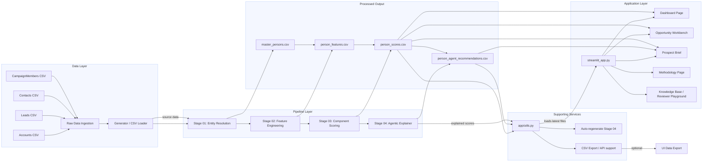

# End-to-End Application Architecture

This file captures the full SFDC Scoring Engine architecture from raw data ingestion through model scoring, explanation generation, and Streamlit application delivery.

