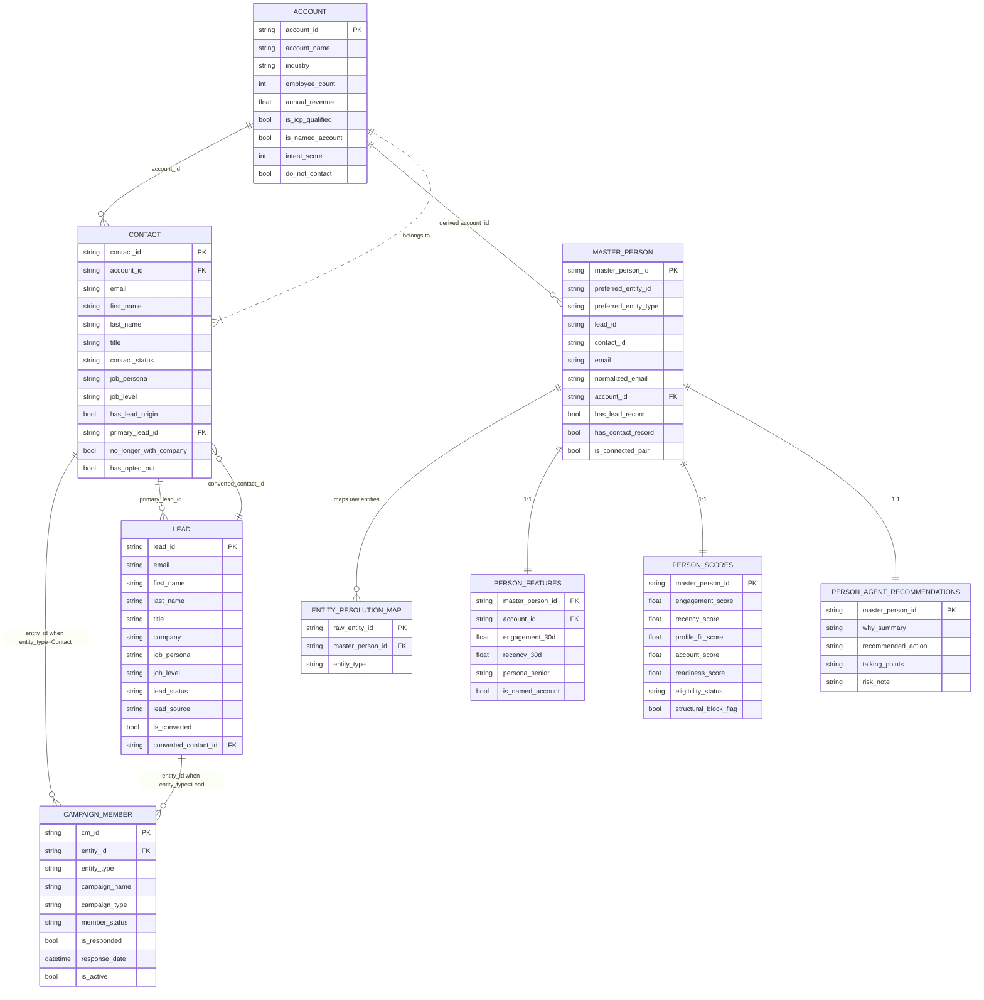

# Data Entity Relationship Diagram

This diagram describes the key raw and processed entities in the Salesforce readiness scoring pipeline.

```mermaid
erDiagram
    ACCOUNT {
        string account_id PK
        string account_name
        string industry
        int employee_count
        float annual_revenue
        bool is_icp_qualified
        bool is_named_account
        int intent_score
        bool do_not_contact
    }

    LEAD {
        string lead_id PK
        string email
        string first_name
        string last_name
        string title
        string company
        string job_persona
        string job_level
        string lead_status
        string lead_source
        bool is_converted
        string converted_contact_id FK
    }

    CONTACT {
        string contact_id PK
        string account_id FK
        string email
        string first_name
        string last_name
        string title
        string contact_status
        string job_persona
        string job_level
        bool has_lead_origin
        string primary_lead_id FK
        bool no_longer_with_company
        bool has_opted_out
    }

    CAMPAIGN_MEMBER {
        string cm_id PK
        string entity_id FK
        string entity_type
        string campaign_name
        string campaign_type
        string member_status
        bool is_responded
        datetime response_date
        bool is_active
    }

    MASTER_PERSON {
        string master_person_id PK
        string preferred_entity_id
        string preferred_entity_type
        string lead_id
        string contact_id
        string email
        string normalized_email
        string account_id FK
        bool has_lead_record
        bool has_contact_record
        bool is_connected_pair
    }

    ENTITY_RESOLUTION_MAP {
        string raw_entity_id PK
        string master_person_id FK
        string entity_type
    }

    PERSON_FEATURES {
        string master_person_id PK
        string account_id FK
        float engagement_30d
        float recency_30d
        string persona_senior
        bool is_named_account
    }

    PERSON_SCORES {
        string master_person_id PK
        float engagement_score
        float recency_score
        float profile_fit_score
        float account_score
        float readiness_score
        string eligibility_status
        bool structural_block_flag
    }

    PERSON_AGENT_RECOMMENDATIONS {
        string master_person_id PK
        string why_summary
        string recommended_action
        string talking_points
        string risk_note
    }

    ACCOUNT ||--o{ CONTACT : "account_id"
    CONTACT ||--o{ CAMPAIGN_MEMBER : "entity_id when entity_type=Contact"
    LEAD ||--o{ CAMPAIGN_MEMBER : "entity_id when entity_type=Lead"
    LEAD ||--o{ CONTACT : "converted_contact_id"
    CONTACT ||--o{ LEAD : "primary_lead_id"
    CONTACT }|..|| ACCOUNT : "belongs to"

    MASTER_PERSON ||--o{ ENTITY_RESOLUTION_MAP : "maps raw entities"
    MASTER_PERSON ||--|| PERSON_FEATURES : "1:1"
    MASTER_PERSON ||--|| PERSON_SCORES : "1:1"
    MASTER_PERSON ||--|| PERSON_AGENT_RECOMMENDATIONS : "1:1"
    ACCOUNT ||--o{ MASTER_PERSON : "derived account_id"
```
