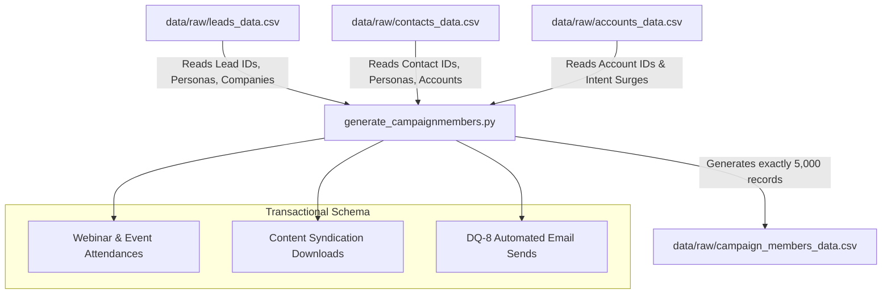

# CampaignMember Synthetic Generation Design Specification

This document details the relational design, schemas, and specific data quality (DQ) injection algorithms used to generate synthetic, transactional CampaignMember records for the Salesforce scoring engine.

---

## 1. Unified Sourcing Flow

CampaignMember records are transactional child records in the Salesforce relational model. The generator dynamically links campaigns to our existing Accounts, Leads, and Contacts:

---

## 2. Relational Composition & Volumes

- **Target Volume**: Exactly 5,000 CampaignMember records.
- **Relational Integrity**: Every generated CampaignMember `entity_id` must match a valid `lead_id` (starts with `00Q`) or `contact_id` (starts with `003`) present in the base CSVs.

---

## 3. Buying-Committee & Clustered Account Engagement

To support downstream account-level aggregations (like `engaged_contact_count`, `account_engagement_score`, and `buying_committee_activity`), the campaign membership generator employs a relational clustering engine:

### A. Named Account Scaling
- Named accounts represent high-value strategic targets. The script ensures that multiple contacts associated with the same `account_id` (representing a buying committee, e.g. 3–6 contacts including CISOs, VPs, and Managers) receive overlapping campaign memberships.
- Simulates coordinated team actions (e.g. CISO and VP Security from the same account attending the same "Executive Dinner" event).

### B. High-Intent Clustered Engagement
- High-intent accounts (intent_score > 75 in `accounts_data.csv`) receive a higher density of campaign responses.
- Campaign response dates for contacts at high-intent accounts are statistically clustered within tight time-windows rather than uniformly scattered over the 180-day history.

### C. Coordinated 14-Day Engagement Surges
- Designates exactly **10% of high-intent accounts** as "Surging Accounts" exhibiting a massive spike in recent activity.
- For surging accounts, the generator creates a high volume of CampaignMember response records (e.g. 10-15 responses across 3+ contacts/leads) clustered within a **14-day evaluation window** (e.g. between `2026-05-01` and `2026-05-15`).
- This perfectly stress-tests downstream **surge detection** algorithms and **buying committee engagement spikes**!

---

## 4. Implementing DQ-8 (Automation Inflation) & Persona H

### A. DQ-8 Enforcements
- Exactly **30% of all person records** (Leads and Contacts combined) will have `automation_share > 70%` in their membership history.
- Automated sends are generated using `Email`, `Advertisement`, or `Telemarketing` campaigns with `member_status = 'Sent'` and `is_responded = False`.
- **Injection Algorithm**: We sample exactly 30% of Lead/Contact IDs. For these selected prospects, we bulk-generate a series of automated email sends, ensuring they represent at least 70% of their total campaign memberships.

### B. Explicit Configuration of Persona H (Henry Inflated)
We search for the Lead record generated for **Persona H** (`lead_id = 00QARCHETYPE0000H` or matching first name "Henry") and inject:
- Exactly **40 CampaignMember records** in total.
- Exactly **38 automated sends** (`campaign_type = 'Email'`, `member_status = 'Sent'`, `is_responded = False`).
- Exactly **2 active responses** (e.g. 1 Webinar Attended and 1 Content Syndication Registered).

---

## 5. Schema Fields & Generation Logic

| Field Name | Type | Key Generation Strategy |
| :--- | :--- | :--- |
| `cm_id` | `str` | Salesforce CampaignMember format: `00v` + 15 alphanumeric characters. Unique. |
| `entity_id` | `str` | Relational reference to `lead_id` (starts with `00Q`) or `contact_id` (starts with `003`). |
| `entity_type` | `str` | Mapped exactly: `Lead` or `Contact`. |
| `campaign_name` | `str` | Realistic naming pool: e.g. "Webinar: Advanced SOC Threat Detection", "Event: BlackHat 2026". |
| `campaign_type` | `str` | Webinar, Event, Content Syndication, Email, Advertisement, Telemarketing. |
| `member_status` | `str` | Mapped: `Sent`, `Opened`, `Clicked`, `Registered`, `Attended`, `Responded`. |
| `is_responded` | `bool` | `True` for responses (Attended, Clicked, Registered), `False` for sends/opens. |
| `response_date` | `str` | Valid ISO timestamp within `created_date` and `now` (null if `is_responded` is False). |
| `is_active` | `bool` | High probability `True` (~85%) representing active campaigns. |
